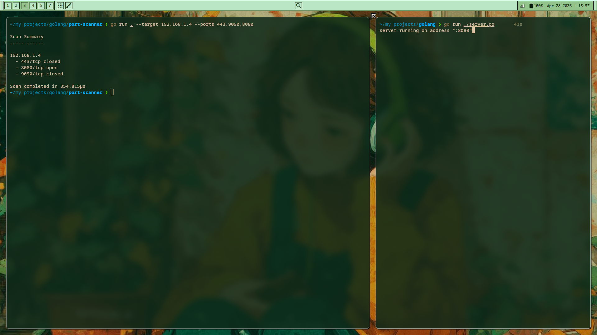
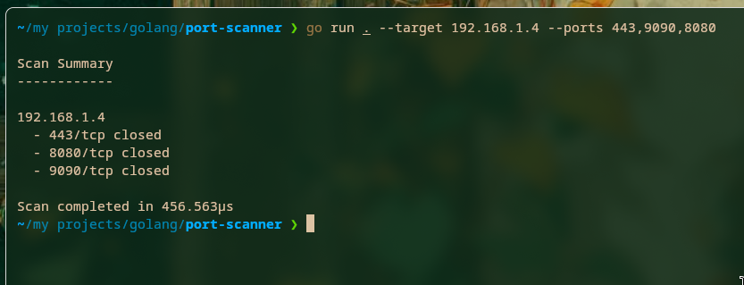

---

# 🛡️ Go Port Scanner

A simple and fast **LAN security scanner** written in Go.
It scans IPs or domains and detects open TCP ports using concurrent network connections.

---

### 🖥️ Local Server Detection



## ✨ Features

* 🌐 Domain → IP resolution
* 📡 Scan single IP or multiple resolved IPs
* ⚡ Concurrent port scanning (fast execution)
* 🔢 Flexible port input:

  * `22,80,443`
  * `8000-8005`
* 🎯 Preset ports (optional)
* ⏱️ Configurable timeout
* 📊 Clean grouped output per IP

---

## 📦 Installation

```bash
git clone https://github.com/osamah22/go-port-scanner.git
cd go-port-scanner
go build -o port-scanner
```

---

## 🚀 Usage

### Scan a single IP

```bash
./port
```
